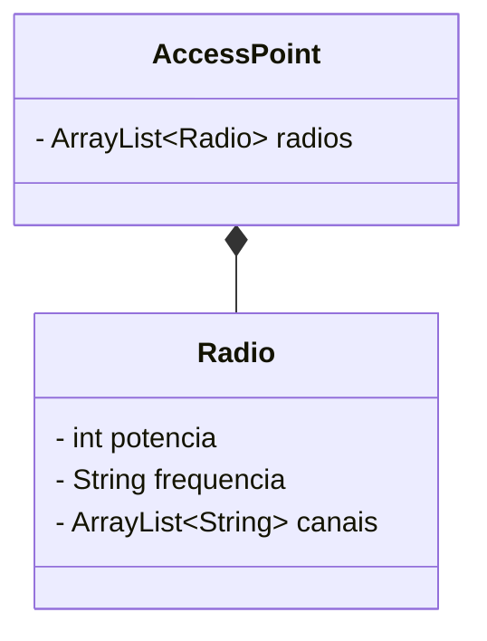
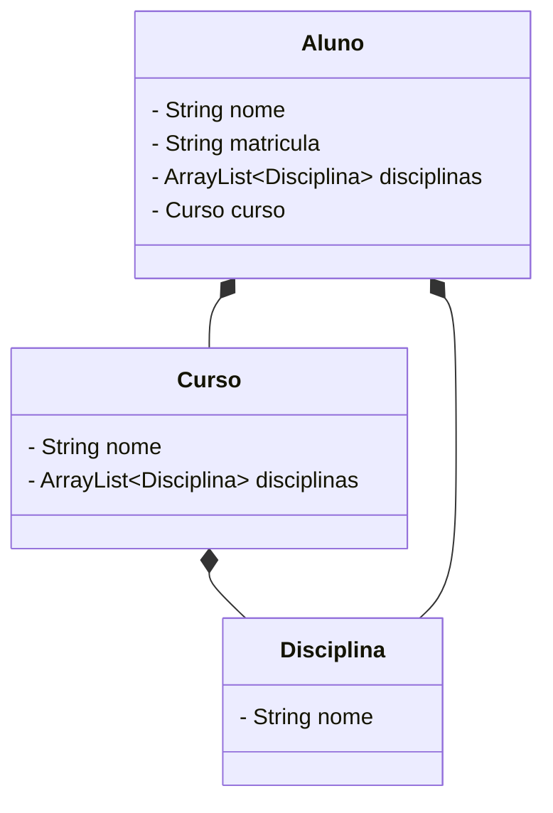
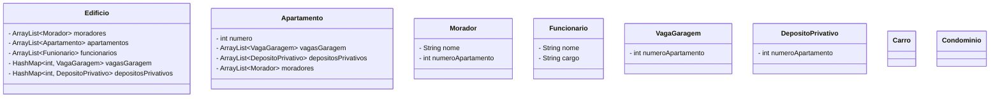

# Diagrama de classes UML

```mermaid
classDiagram
    class AccessPoint{
        - ArrayList~Radio~ radios
    }
    
    class Radio {
        - int potencia
        - String frequencia
        - ArrayList~String~ canais
    }

    AccessPoint *-- Radio
```

```mermaid
classDiagram
    class Aluno {
        - String nome
        - String matricula
        - ArrayList~Disciplina~ disciplinas
        - Curso curso
        
    }
    
    class Disciplina {
        - String nome 
    }
    
    class Curso {
        - String nome
        - ArrayList~Disciplina~ disciplinas
    }
    
    Curso *-- Disciplina
    Aluno *-- Curso
    Aluno *-- Disciplina
```

```mermaid
classDiagram
    class Edificio {
        - ArrayList~Morador~ moradores
        - ArrayList~Apartamento~ apartamentos
        - ArrayList~Funionario~ funcionarios
        - HashMap~int, VagaGaragem~ vagasGaragem
        - HashMap~int, DepositoPrivativo~ depositosPrivativos
       
    }
    
    class Apartamento {
      - int numero
      - ArrayList~VagaGaragem~ vagasGaragem
      - ArrayList~DepositoPrivativo~ depositosPrivativos
      - ArrayList~Morador~ moradores
    }
    
    class Morador {
        - String nome
        - int numeroApartamento
    }

    class Funcionario {
        - String nome
        - String cargo
    }

    class VagaGaragem {
        - int numeroApartamento
    }

    class DepositoPrivativo {
        - int numeroApartamento
        
    }

    class Carro {

    }

    class Condominio {

    }
    
   
```
